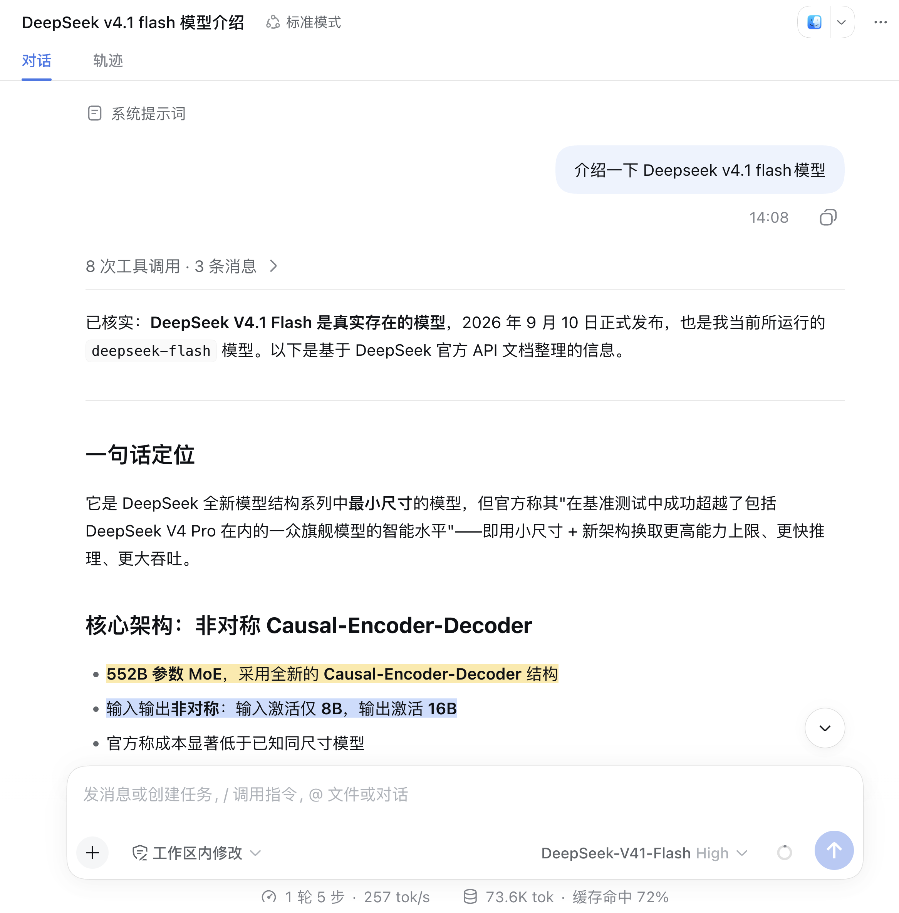
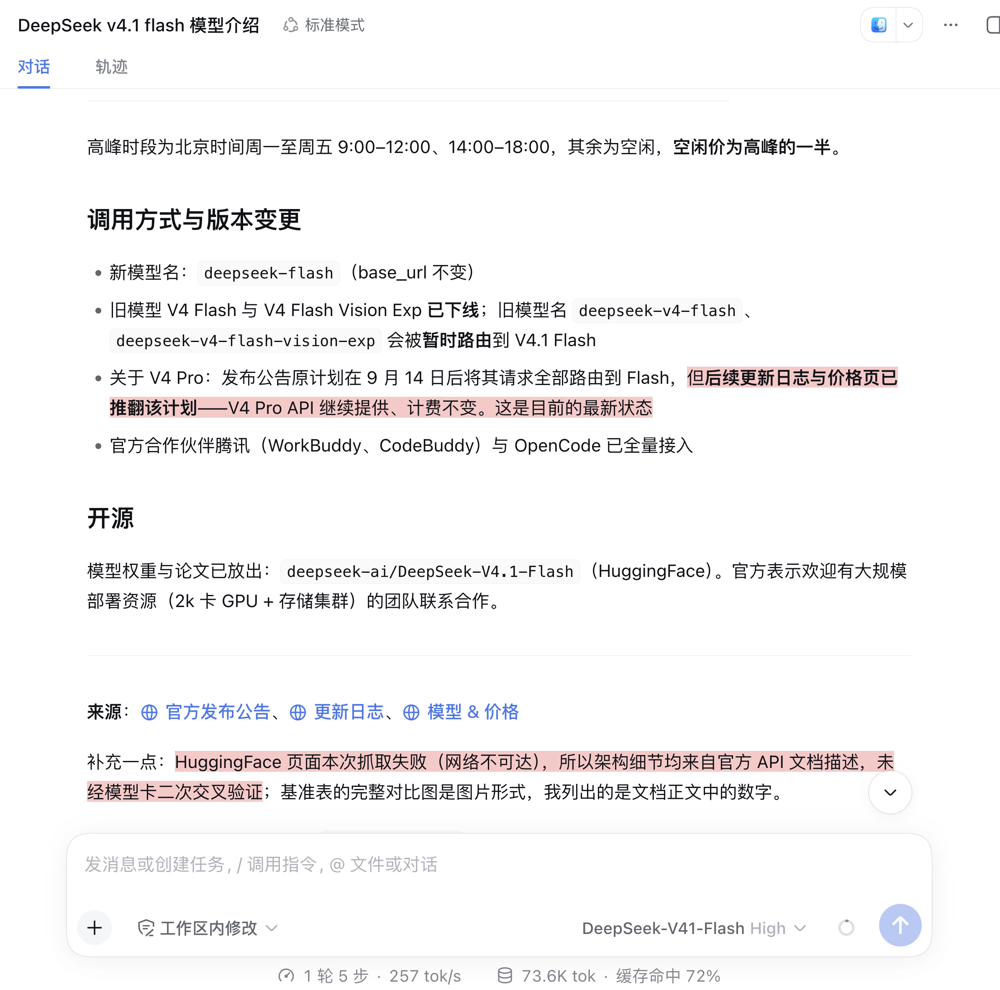
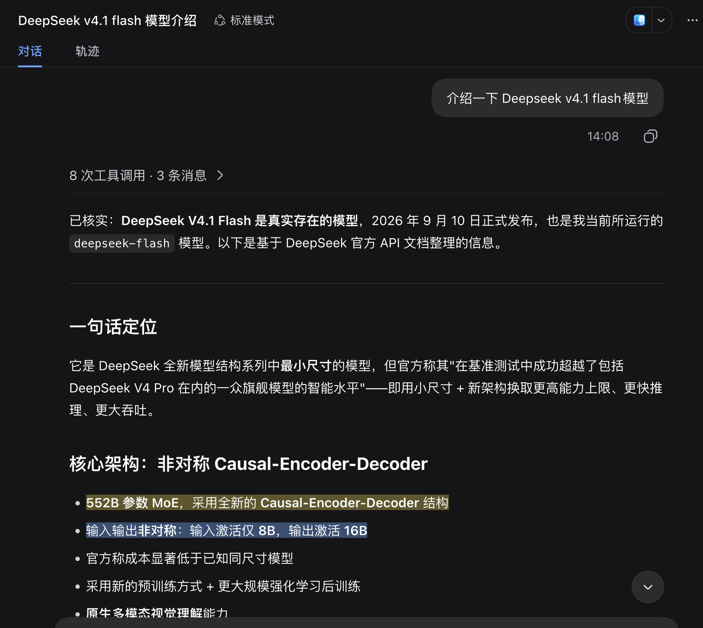

# DSH 回答批注高亮插件

给 DSH Web 的 AI 回复自动加重点、定义、警告和问题高亮。主回答照常流式输出，批注在回答完成后单独生成并渲染。

## 1. 它解决什么问题

**像批注一样高亮回答内的语句**。AI 回答的语句不仅仅是标题重要，一些句子也得在长篇大论里优先让人查看。

这个插件在回答完成后，**额外调用一次模型**，把当前回答里值得注意的片段标出来。默认调用 `deepseek-official/deepseek-flash`，这次调用只用于生成批注，不影响主回答，也不会改写原始会话日志。







## 2. 功能

- 回答完成后自动生成批注
- 支持 4 类语义高亮，颜色说明如下
- 亮色和暗色主题自动适配
- 刷新页面后恢复高亮
- 本地 JSONL 存储
- 不改写原始回答和会话日志

| 类型 | 颜色 | 用途 |
| --- | --- | --- |
| `key-point` 关键点 | 亮黄色 | 标出结论、核心事实和最值得先看的信息 |
| `definition` 定义 | 蓝色 | 标出概念解释、术语说明和边界条件 |
| `warning` 警告 | 亮红色 | 标出风险、限制、失效信息和需要注意的反直觉结论 |
| `question` 问题 | 绿色 | 标出待确认事项、开放问题和需要用户进一步决策的点 |

以上颜色按亮色主题描述；暗色主题会自动调整亮度和透明度以保持可读性。

## 3. 系统要求

- DSH Web
- Node.js 20 或更高版本
- 支持 CSS Custom Highlight API 的浏览器
- 已配置可用的 DeepSeek 模型路由

## 4. 安装

在插件目录执行：

```sh
npm install
npm run build:client
```

在 DSH 工作目录安装到 `web` profile：

```sh
dsh plugin --profile web add github:Matcha-Eason/dsh-answer-highlight
```

## 5. 快速开始

1. 启动 DSH Web。
2. 新开一轮对话。
3. 等主回答完成。
4. 通常再等 3 到 8 秒，页面会出现高亮。

## 6. 默认模型

插件默认使用 `deepseek-official/deepseek-flash` 生成批注。这个调用是独立的辅助调用，会额外消耗 token。若需要改成其他模型，可在插件配置里覆盖 `provider` 和 `model`；若想和主回答模型保持一致，把它们配置成同一条路由即可。

## 7. 工作方式

```text
主回答完成
  ↓
读取用户问题和回答文本
  ↓
调用 deepseek-flash 生成批注
  ↓
校验 quote 并写入本地 JSONL
  ↓
浏览器轮询批注接口
  ↓
在 DOM 中定位文本并渲染高亮
```

主回答和批注是两条链路。主回答不受批注失败影响。

## 8. 数据和隐私

批注默认存储在：

```text
$DSH_HOME/plugin-data/dsh-answer-highlight/annotations
```

也可以用 `DSH_ANSWER_HIGHLIGHT_DATA` 指定其他目录。每个 Session 一个 JSONL 文件，每行对应一个 assistant 消息。空批注也会写一条记录，用来避免重复调用模型。

## 9. 浏览器支持

需要浏览器支持 CSS Custom Highlight API。支持时会显示四类颜色高亮；不支持时页面保持原样。Safari 目前不支持。

## 10. 常见问题

**为什么没有高亮？**

- 旧会话不会自动补标
- 回答可能还没有生成完
- 浏览器不支持 CSS Custom Highlight API
- 模型返回的 quote 没有在 DOM 中唯一定位
- 批注调用失败或超时

**会消耗额外 token 吗？**

会。每次回答完成后，插件会用 `deepseek-flash` 单独调用一次模型。

**旧会话会补标吗？**

不会。只有插件启动后新完成的 assistant 消息会生成批注。

## 11. 卸载

```sh
dsh plugin --profile web remove dsh-answer-highlight
```

如需彻底清理本地数据，再删除默认存储目录。

## 12. 许可证

MIT
